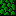
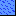

# カプセル戦記（SDガンダム ガチャポン戦士2）仕様書

## 1. ゲーム概要

### 1.1 基本情報
- **タイトル**: SDガンダム ガチャポン戦士2 カプセル戦記
- **プラットフォーム**: ファミリーコンピュータ
- **ジャンル**: アクションバトルシミュレーション
- **前作**: ガチャポン戦士 スクランブルウォーズ

### 1.2 ゲームコンセプト
戦略シミュレーションパートとアクションバトルパートを組み合わせたハイブリッドゲーム。
プレイヤーはユニットを生産・移動させ、敵と遭遇時にはアクションバトルで勝敗を決する。

---

## 2. マップシステム

### 2.1 地形一覧

| No | アイコン | 地形名 | 説明 |
|----|:--------:|--------|------|
| 1 |  | 宇宙 | 標準的な宇宙空間 |
| 2 |  | 平野 | 地球の平地 |
| 3 |  | 森林 | 木々が生い茂る地形 |
| 4 |  | アステロイド | 小惑星帯 |
| 5 |  | 水中 | 海や湖の水中 |
| 6 |  | 砂漠 | 砂地の地形 |
| 7 |  | 大気圏 | 大気圏突入エリア |
| 8 |  | 火山 | 火山地帯（進入不可） |
| 9 |  | 小惑星 | 単体の小惑星 |
| 10 |  | クレータ | 衝突跡の地形 |
| 11 |  | ブラックホール | 特殊地形 |
| 12 |  | 大クレータ | 大型のクレーター |
| 13 |   | GP | 連邦軍生産拠点 |
| 14 |   | GB | ジオン軍生産拠点 |
| 15 |  | 都市 | 都市部（占領可能） |
| 16 |  | コロニー | スペースコロニー（占領可能） |
| 17 |  | 補給基地 | 補給施設（占領可能） |
| 18 |  | スペースベース | 宇宙基地（占領可能） |

※ `block.gif` は進入不可地形の汎用アイコン

### 2.2 占領システム

占領可能な施設:
- **GB（ジオン軍拠点）**: 占領すると生産拠点として使用可能
- **都市**: 占領すると毎ターンCP収入 + 回復効果
- **コロニー**: 占領すると毎ターンCP収入
- **補給基地**: 占領すると100%回復可能
- **スペースベース**: 占領すると宇宙での補給拠点

---

## 3. 移動システム

### 3.1 ユニットタイプ

| タイプ | 説明 |
|--------|------|
| 一般 | 標準的なモビルスーツ |
| 水陸両用 | 水中での移動に適したユニット |
| 艦船 | 大型艦船、ユニット搭載可能 |

### 3.2 移動コスト表

| 地形 | 一般 | 水陸両用 | 艦船 |
|------|------|----------|------|
| 宇宙 | 1 | 1 | 1 |
| 平野 | 1 | 1 | 1 |
| 森林 | 2 | 2 | 1 |
| アステロイド | 3 | 3 | 1 |
| 水中 | 3 | 1 | 1 |
| 砂漠 | 3 | 3 | 1 |
| 大気圏 | 全消費 | 全消費 | 全消費 |
| 火山 | - | - | - |
| 小惑星 | 1 | 1 | 1 |
| クレータ | 1 | 1 | 1 |
| ブラックホール | - | - | - |
| 大クレータ | 1 | 1 | 1 |
| GP | 1 | 1 | 1 |
| GB | 1 | 1 | 1 |
| 都市 | 1 | 1 | 1 |
| コロニー | 1 | 1 | 1 |
| 補給基地 | 1 | 1 | 1 |
| スペースベース | 1 | 1 | 1 |

※ 「-」は進入不可を表す
※ 「全消費」は移動力を全て消費することを表す

### 3.3 搭載システム

艦船ユニットは他のユニットを搭載可能:
- **搭載**: 艦船に隣接してコマンド実行
- **発進**: 艦船から隣接マスに発進
- 搭載中のユニットは移動・戦闘不可
- 搭載中は毎ターン20%回復

### 3.4 射撃システム

一部ユニットはマップ上から射撃可能:
- 射程内の敵ユニットに対して使用
- ENを消費
- ダメージは固定値

---

## 4. 戦闘システム

### 4.1 戦闘の流れ

1. ユニット同士がマップ上で遭遇
2. 戦闘画面に移行
3. アクションバトル開始
4. HP が 0 になったユニットが敗北
5. 勝者はマップ上でそのまま行動継続

### 4.2 戦闘地形効果

| 地形 | 障害物 | 慣性 | 特殊効果 |
|------|--------|------|----------|
| 宇宙 | なし | あり | - |
| 平野 | なし | なし | - |
| 森林 | あり | なし | 横方向攻撃を遮断 |
| アステロイド | あり | あり | - |
| 水中 | なし | なし | 浮力（上方向）、水陸両用は無効 |
| 砂漠 | なし | なし | - |
| 大気圏 | なし | あり | 重力（下方向）、画面下で継続ダメージ |
| コロニー | あり | なし | - |
| クレータ | なし | なし | - |

### 4.3 戦闘画面の要素

- **HP**: ユニットの耐久力（ダメージを受けると減少）
- **EN**: エネルギー（攻撃に使用、射撃で消費）
- **障害物**: 地形によって出現、攻撃を遮断
- **慣性**: 移動後に滑る効果（宇宙、大気圏など）
- **重力/浮力**: 自動的に上下方向に移動

### 4.4 武器システム

#### 武器一覧

| No | 武器名 | カタログ表記例 |
|----|--------|----------------|
| 1 | ビームライフル | ビームライフル、ビーム砲、レーザー砲 |
| 2 | マシンガン | マシンガン |
| 3 | バズーカ砲 | バズーカ砲 |
| 4 | ビット | ビット、サイコミュ、ファンネル |
| 5 | 拡散ビーム砲 | 拡散ビーム砲 |
| 6 | 拡散メガ粒子砲 | 拡散メガ粒子砲 |
| 7 | メガ粒子砲 | メガ粒子砲 |
| 8 | ハイメガ粒子砲 | ハイメガ粒子砲 |
| 9 | バルカン砲 | バルカン砲 |
| 10 | ビームサーベル | ヒートホーク、ヒートサーベル、ビームサーベル |
| 11 | ヒートロッド | ヒートロッド |
| 12 | ビームナギナタ | ビームナギナタ |
| 13 | グレネード | グレネード |
| 14 | ミサイル | ミサイル、水中ミサイル |
| 15 | 変形 | 変形 |

#### 武器パラメータ

各武器には以下のパラメータがある:
- **威力**: 攻撃のダメージ量
- **弾速**: 弾の移動速度（射撃武器のみ）
- **装填数**: 使用可能回数（一部武器のみ）

#### 操作方法

- **Aボタン**: A武器を使用
- **Bボタン**: B武器を使用
- **A+Bボタン**: AB武器を使用（同時押しまたはA押しながらB）

### 4.5 戦闘アイテム

戦闘中にランダムで出現:

| アイテム | 効果 |
|----------|------|
| 力ドリンク | EN +20 回復 |
| 高速足袋 | 10秒間最大速度（6）で移動可能 |
| 招き猫 | CP ボーナス（1000/500/100のいずれか） |
| 縛り札 | 5秒間行動不能 |

### 4.6 障害物キャラクター

特定の地形で出現する障害物:

| キャラクター | 出現地形 | 効果 |
|--------------|----------|------|
| 岩 | コロニー | 接触でダメージ |
| アステロイド | アステロイド | 移動する障害物 |
| 木 | 森林 | 横方向攻撃を遮断 |

---

## 5. ユニットシステム

ユニットの詳細（パラメータ、ユニット一覧、生産優先度など）は [capsule_senki_units.md](capsule_senki_units.md) を参照。

---

## 6. 生産システム

### 6.1 生産の仕組み

- **生産拠点**: GP（連邦）または占領したGB（ジオン）
- **生産コスト**: CP（キャピタルポイント）を消費
- **生産時間**: ターン数（TN）で表示、指定ターン後に完成

※ ユニット生産表と生産優先度の詳細は [capsule_senki_units.md](capsule_senki_units.md) を参照。

---

## 7. 回復システム

### 7.1 回復方法

| 方法 | 回復量 | 条件 |
|------|--------|------|
| 補給基地 | 100% | 補給基地マスで待機 |
| 都市 | 10%/ターン | 都市マスで待機 |
| 艦船搭載 | 20%/ターン | 艦船に搭載された状態 |

### 7.2 回復タイミング

- ターン開始時に自動で回復処理
- 戦闘中はアイテム以外で回復不可

---

## 8. 戦闘テクニック

### 8.1 基本テクニック

#### 縦サーベル
上下方向に出すサーベルは同じ位置に固定されるため、横方向に斬りかかるサーベルに比べ当てやすく、敵の攻撃によるキャンセルを受けにくい。サーベルを出した状態である程度移動可能で、横滑りで当てていける。

#### ムーンウォーク射撃
宇宙ステージで慣性を利用して後退し続けながら射撃するテクニック。画面の上部や下部で行うとより反撃を受けにくい。高難度のCPU戦で有効。

### 8.2 CPU敵指揮官の特徴

| 指揮官 | 特徴 | 対策 |
|--------|------|------|
| マクベ | ダメージを受けると攻撃停止（約1秒） | 接近戦で連続攻撃 |
| バスク | 被ダメ停止が短い（約0.5秒） | ムーンウォーク射撃または接近戦 |
| ハマーン | 被ダメによる停止なし | ムーンウォーク射撃が有効 |
| シャア | 反撃精度が高い、連射が正確 | 地上ならミサイル、宇宙ならムーンウォーク射撃 |

---

## 9. 勝利条件

### 9.1 標準ルール

以下のいずれかで勝利:
1. **敵本拠地占領**: 敵のGP/GBを全て占領
2. **敵全滅**: 敵ユニットを全て撃破
3. **ターン制限**: 制限ターン終了時に戦力優勢

### 9.2 シナリオルール

シナリオごとに特殊な勝利条件が設定される場合あり

---

## 10. ゲームモード

### 10.1 対戦モード

- **1P vs CPU**: プレイヤー vs コンピュータ
- **1P vs 2P**: プレイヤー同士の対戦

### 10.2 シナリオモード

ガンダムシリーズの各作品をモチーフにしたシナリオをプレイ

---

## 11. 参考情報

### 11.1 情報源
- カプセル戦記 Wiki: http://gachapon2.gamedb.info/wiki/

### 11.2 改訂履歴

| 日付 | 内容 |
|------|------|
| 2026-01-16 | 初版作成 |
| 2026-01-16 | ユニットパラメータ詳細、武器システム、戦闘テクニック追加 |
| 2026-01-16 | ユニット仕様を別ファイル（capsule_senki_units.md）に分離 |
| 2026-01-16 | 地形一覧にアイコン画像を追加 |
